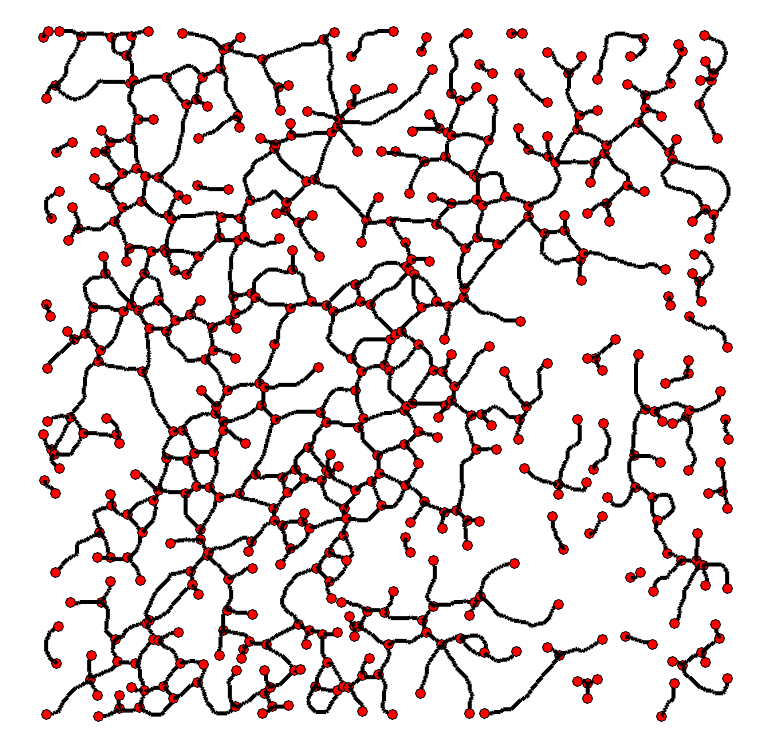
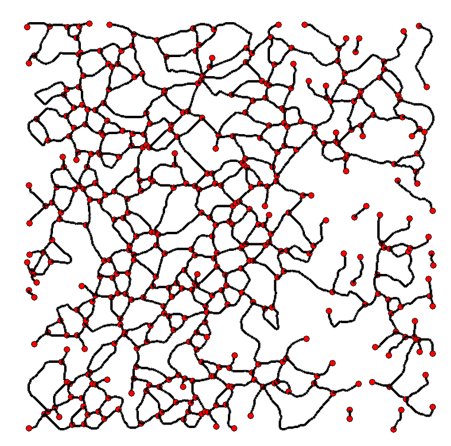

BioFiber App GUI

The pipeline including Gabor detection, graph-based fiber representation
and parametric maps analysis can be tested through a MATLAB-based
graphical user interface (GUI), (Figure 1), which can run on MATLAB
versions as early as 2015a version. It allows testing of intermediate
steps of the methods of one sample image, and additional parallel
testing of multiple images. Results are stored as either .png files or
.csv files, as detailed below.

{width="4.899160104986876in"
height="3.573140857392826in"}

Figure . Graph-based fiber analysis GUI application

**Start: select image **

Test sample images are found in the *fiberGraphApp/sample\_img*
directory which can be selected once Start:select image button is
pressed and directory explorer is enabled. The user is then presented
with a selection prompt (Figure 2) to indicate the type of image
previously selected. (E.g. fluorescent or SHF microscopy images
typically show a darker background with lighter structures of interest,
other stainings can show a light background with the main objects at
lower levels of color/intensity).

{width="3.5042016622922136in"
height="0.8892836832895888in"}

Figure . Image type selection

**Fiber extraction pipeline **

The fiber extraction pipeline is divided into multiple steps (Figure 3)
and can be tested on one sample image that has been previously loaded
with 'Start:select' image button. The results of these steps will be
directly stored as .png files in a pre-created directory,
*fiberGraphApp/stats/img/'file\_name'*.

1.  First step is represented by fiber enhancement with Gabor filters
    (with predefined filters to cover a wide range of fiber features).

2.  Step 2 refers to the creation of a fiber morphological skeleton and
    its associated skeleton graph network (collection of nodes connected
    by edges; nodes can represent crossing fibers (2D representation) or
    fiber ends).

3.  Step 3 is entirely optional, depending on the quality of
    skeletonization observed in during step 3. Briefly, the principle
    behind is to reconnect fibers that might have been mis-represented
    before, within a certain predefined radius. This step will attempt
    to mitigate the artefacts arising from previous step, and will
    typically result in a less fragmented, more connected network, but
    will be time-consuming. This is important to remember when consider
    the batch processing step.

4.  The fourth step will assign a simplified graph network to the
    previous skeleton, where fibers are represented here through
    straight lines connecting previously detected nodes.

**Fiber features and parametric maps**

The second panel can be accessed once fiber analysis has been performed,
and relevant features can be extracted.

1.  By selecting Gabor skeleton and Gabor graph-based features buttons,
    two different maps will be created respectively. These represent the
    local fiber thickness and orientation of the morphological skeleton
    and graph-based representation. Additionally, graph-based local
    properties of each fiber will be stored in a .csv file, located at
    *fiberGraphApp/stats/graph/'file\_name.csv'*.

2.  Selecting pore features will save various morphological shape
    characteristics of pores, such as area, eccentricity, perimeter,
    orientation, in a .csv file, located at
    *fiberGraphApp/stats/pores/'file\_name.csv'*.

3.  The parametric maps panel creates the extrapolated and dense fiber
    length and pore isotropy maps, such as described in the main paper.
    The resuls are stored in *fiberGraphApp/stats/img/'file\_name'*.

**Batch processing**

To apply the fiber extraction - feature extraction - map analysis
pipeline to multiple images in parallel, the user can press 'select
files' button and subsequently select a folder, not a file (e.g.
*fiberGraphApp/sample\_img/sample\_batch*.) by opening it from the
directory explorer. The test folder sample\_batch contains a few images
already; the user can create a different directory or simply place all
images intended for analysis in this one. Ideally, images should be of
the same type, as the user will be asked to confirm the acquisition
type.

To restart the analysis and reset the data values, the user can press
'reset'. This will close all figures and re-open the GUI application.

{width="2.085157480314961in"
height="2.0905850831146107in"} {width="2.0672265966754155in"
height="2.078021653543307in"}

{width="2.064362423447069in"
height="1.9896828521434822in"}
{width="2.0433344269466316in"
height="1.9899846894138233in"}

{width="2.016806649168854in"
height="1.9955774278215224in"} {width="2.0934765966754156in"
height="1.9909722222222221in"}

{width="2.0418897637795275in"
height="1.8942202537182853in"} {width="2.0547856517935257in"
height="1.893523622047244in"}

{width="2.1181496062992125in"
height="1.9491196412948382in"} {width="2.0846259842519683in"
height="1.948908573928259in"}

{width="2.0997758092738406in"
height="1.9322123797025372in"} {width="2.0659634733158354in"
height="1.931461067366579in"}

Figure 3. Results of the pipeline test to one image sample. First row
depicts the test sample and fiber detection with Gabor filters after
Step1. Second row shows the morphological skeleton and associated graph
(Step2). Third row shows the reconnected fibers results (Step3) and
associated simplified graph-based representation (Step4). Fourth row
illustrates the parametric fiber length and pore isotropy maps. Fifth
and sixth rows illustrate fiber thickness and local fiber orientation
map for both the morphological skeleton and the graph-based
representation of fibers.
